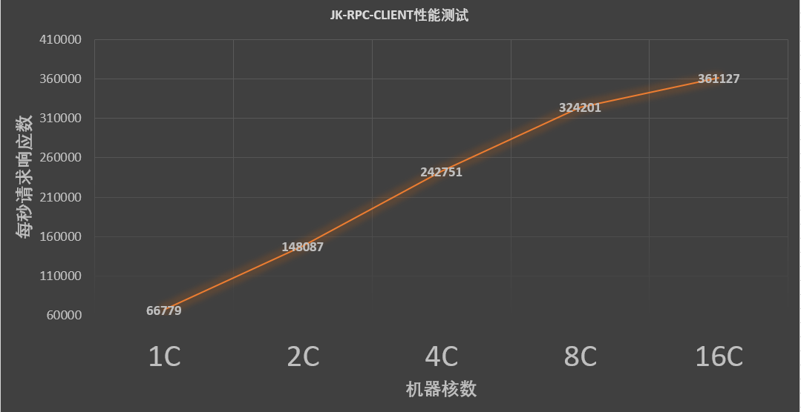
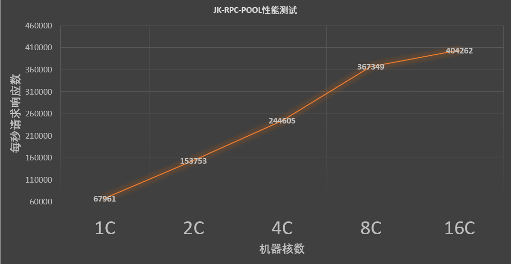
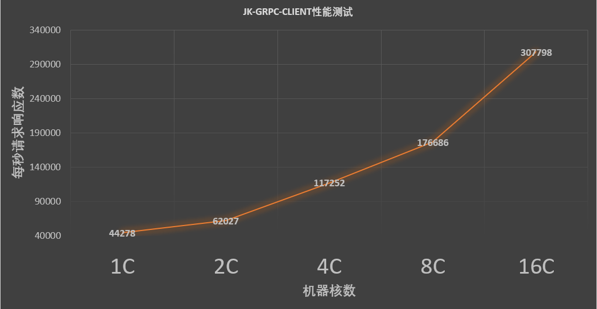
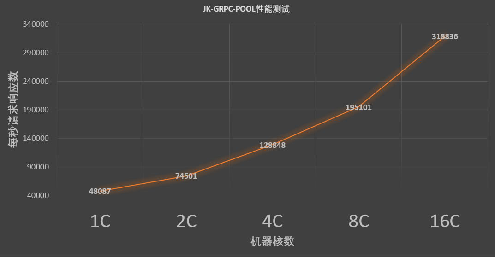
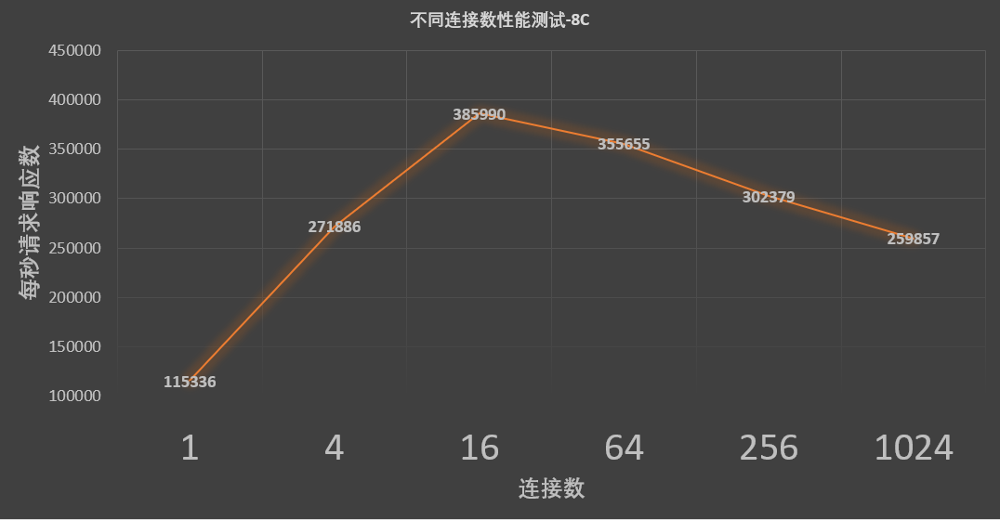
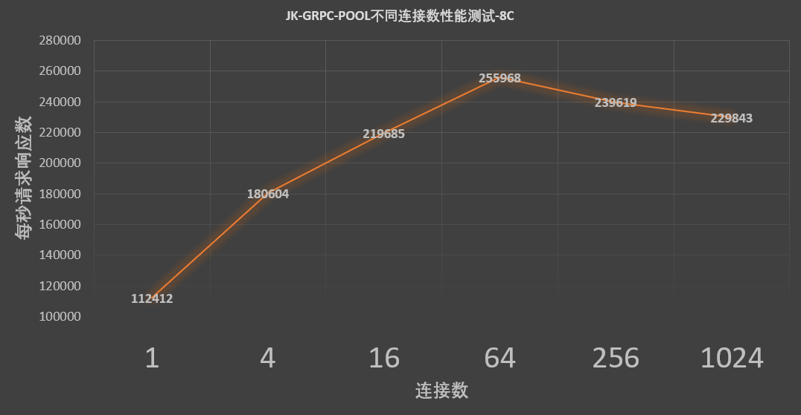
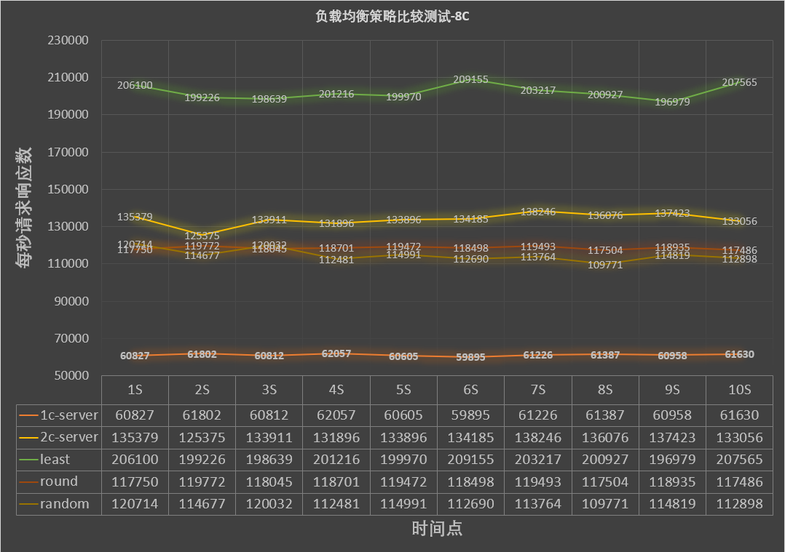

# jkfr

# 简单使用示例

## JK-RPC-CLIENT

## JK-RPC-POOL

## JK-GRPC-CLIENT

## JK-GRPC-POOL

# 性能测试

## 不同核数机器(云主机)性能测试结果

### JK-RPC-CLIENT

### JK-RPC-POOL

### JK-GRPC-CLIENT

### JK-GRPC-POOL

## 连接池——不同连接数对请求响应性能的影响(8核机器)

由以下测试可看到，无论RPC还是gRPC，当连接池的连接数达到16时，就都差不多达到了请求响应性能的最大值，再增加更多的连接数对请求性能的提升就相对较小，甚至还会使得性能下降。因此，我们连接池的默认最大连接数就设置为了16.
### JK-RPC-POOL

### JK-GRPC-POOL

## 不同负载均衡策略性能比较

